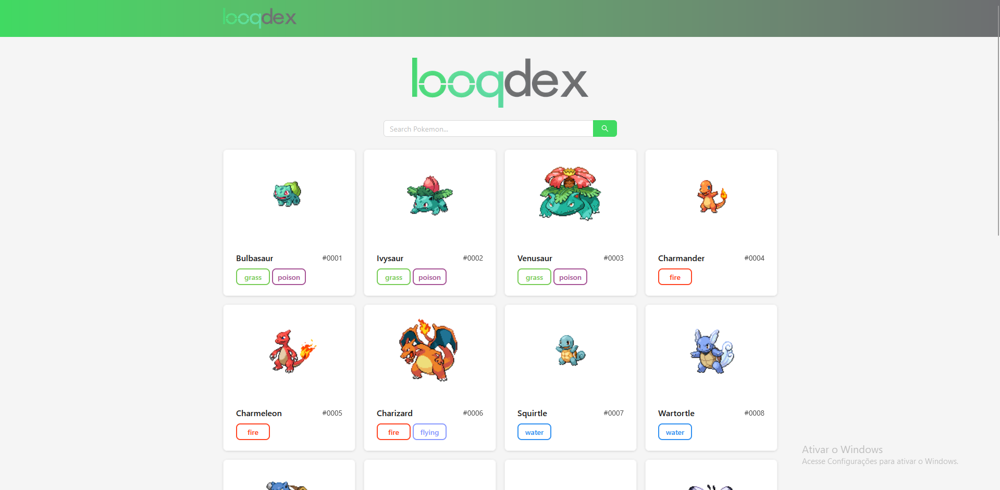

# Pokedex Challenge

## 📌 Resumo do Projeto

Este projeto foi desenvolvido como solução para o **Frontend Challenge**, utilizando a [PokeAPI](https://pokeapi.co/).  
A aplicação é uma **Single Page Application (SPA)** em **ReactJS** que permite listar e buscar Pokémons, além de visualizar informações detalhadas sobre cada um.

---

## 📸 Screenshots

### Página inicial (`/`)

Exibe lista inicial de Pokémons e barra de busca.  


### Detalhes do Pokémon (`/pokemon/:id`)

Mostra informações detalhadas de um Pokémon selecionado.  


---

## 🛠 Tecnologias Utilizadas

- ⚡ [Vite](https://vitejs.dev/)
- ⚛️ [React](https://reactjs.org/)
- 🔄 [React Query](https://tanstack.com/query/latest) – Gerenciamento de estados assíncronos
- 🎨 [Ant Design](https://ant.design/) – Componentes UI
- 🎨 [TailwindCSS](https://tailwindcss.com/) – Estilização com utilitários
- 📊 [Recharts](https://recharts.org/) – Gráficos e visualizações
- 🧪 [Vitest](https://vitest.dev/) – Testes unitários
- 🟦 TypeScript – Tipagem estática para maior segurança no código

---

## 📂 Funcionalidades

- 🔍 Pesquisa de Pokémons por nome
- 📋 Listagem inicial de Pokémons com carregamento dinâmico
- 📄 Página de detalhes com informações individuais
- 🛣️ Rotas para `/` e `/pokemon/:id`
- ✅ SPA dinâmica (sem reload de página)

### ⭐ Extras implementados (bonus)

- 🔢 Paginação
- ⚠️ Tratamento de erros
- 🧪 Testes unitários com cobertura
- 🎨 UI melhorada com **Ant Design**
- 📊 Visualização de dados com **Recharts**
- ⚠️ Lint

---

## 🖥️ Como Iniciar o Projeto Localmente

1. Clone este repositório:

   ```bash
   git clone https://github.com/rodrigoacm10/looqbox-frontend-challenge
   ```

2. Acesse a branch pokedex:

   ```bash
   git checkout pokedex
   ```

3. Instale as dependências:

   ```bash
   npm install
   ```

4. Rode o projeto:
   ```bash
   npm run dev
   ```

## 🖥️ Como Iniciar o Projeto Localmente

Para rodar os testes unitários:

```bash
npm run test
```

Para rodar com cobertura:

```bash
npm run coverage
```
